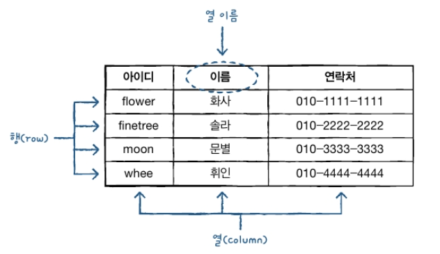

# DBMS와 MySQL

## DBMS

1. 데이터베이스와 DBMS

   - 데이터베이스는 데이터의 집합이다. 우리 일상생활 대부분의 정보가 저장되고 관리되는 것

   - 데이터베이스를 관리하고 운영하는 소프트웨어를 DBMS(Database Management System)라 한다

   - 테이블은 하나 이상의 열(column)과 행(row)로 이루어져 있다

   - DBMS 종류

     | DBMS    | 제작사  | 작동운영체제           | 기타            |
     | ------- | ------- | ---------------------- | --------------- |
     | MySql   | Orcale  | Unix,Linux,Windows,Mac | 오픈소스 (무료) |
     | MariaDB | MariaDB | Unix,Linux,Windows     | 오픈소스 (무료) |
     | Oracle  | Orcale  | Unix,Linux,Windows,Mac | 테이블의 형태   |

   - 테이블의 형태
   
    

2. SQL(Structurde Quert Language)

   1. SQL 언어의 종류
      - DQL(Data Query Language), 데이터 질의어, 데이터 검색, 출력과 관련된 쿼리
        - select.. fro..where
      - DML(Data Manapulation Language),데이터 조작어, 데이터 입력, 수정, 삭제와 관련된 쿼리
        - insert, update, delete
      - DDL(Data Definition Language), 데이터 정의어, 테이블 생성 및 삭제, 테이블 구조 수정과 관련된 쿼리 
        - create table, drop table, arter table
      - TCL(Transaction Control Language), 트랜잭션 제어 언어, 안정적인 데이터 처리르 위한 데이터 처리와 관련된 명령어
        - commit, rollback, savepoint
      - DCL(Data Control Language) 데이터 제어 언어, 권한 부여와 관련된 쿼리 
        - grant, revoke

   ### MySQL 다운로드

   [MySQL다운로드 주소](https://dev.mysql.com/downloads/mysql/)

1. Select Operating System: Micrisoft Windows 확인 후 Go to Download Page 클릭=> Windows(x86, 32-bit), MSI Installer Download 클릭 => No thanks, just start my download. 클릭 

2.  다운파일(mysql-installer-community-8.0.28.0.msi) 클릭 
   - [Choosing a Setup Type] -> Custom 선택 ->[Next]

3. [Select Products and Features]의 [Available Products:] 에서 설치할 제품들 선택 후 오른쪽 이동
   \- [MySQL Servers] - [MySQL Server] - [MySQL Server 8.0] - [MySQL Server 8.0.21 -X64] 
   \- [Applications] - [MySQL Workbench] - [MySQL Workbench 8.0] - [MySQL Workbench 8.0.21 - X64] 
   \- [Documentation] - [Samples and Examples] - [Samples and Examples 8.0] - [Samples and Examples 8.0.21 -X86] 

4. [Installation]에서 3개 항목 확인 후 [Execute] 클릭하여 설치

5. 설치완료되면 가각 항목 초록색 체크 표시되고 [Status]가 'Complete'로 변경된다.
     [Next] 클릭한다.

6. [Product Configuration]에 2개 항목의 환경 설정 필요하다고 나온다.
     [Next] 클릭

7. [High Availability] 에서 기본값 'Standalone MySQL Server / Classic MySQL Replication'
     선택된 상태에서 [Next] 클릭

8. [Type and Networking] - [Config Type] - 'Development Computer' 선택
     [TCP/IP] 체크 , [Port]- '3306'
     [Open Windows Firewall ports for network access] 체크 후 [Next] 클릭

9. [Authenication Method] - 'Use Legacy Authentication Method' 선택 후 [Next]

10. [Accounts and Role] - MySQL 관리자(Root) 비밀번호 설정(1234)

11. [Window Service]에서 MySQL 서버를 원도우의 서비스로 등록 설정
      [Window Service Name] - 'MySQL' 
      [Next] 클릭

12. [Apply Configuration]에서 설정내용을 적용을 위해 [Execute] 클릭
       학 항목이 초록색으로 체크 표시된다. [MySQL Server] 설정이 완료되었다. 
       [Finish] 클릭하여 설정 종료한다.

13. 다시[Product Configuration]이 나타난다 MySQL Server 8.0.21은 설정완료,
      두번째 Samples and Examples 8.0.21을 설정한다 [Next] 클릭

14. [Connect To Server]에 연결할 서버가 보이고 [User name(사용자 이름)] - 'root',
      [Password(비밀번호)] - '1234' 입력 후 [Check] 클릭 하면
      [Status] - 'Connection succeeded'로 변경된다. [Next] 클릭

15. [Apply Configuration] - [Execute] 클릭하여 설정내용 적용, 모든 항목 초록색
       체크 표시, Samples and Examples 설정 완료 [Finish] 버튼 클릭 설정 종료

16. 다시 [Product Configuration]이 나오고 [Status] - 모두 완료됨
       [Next] 버튼 클릭

17. [Installation Complete] - [Start MySQL Workbench after Setup]을 체크 해제
       [Finish] 버튼 클릭. MySQL 설치 완료

#### Mysql 정상 작동 확인

- 시작 - > MySQL -> MySQL Workbench 8.0 CE에서 작업 표시줄 고정 후 실행
- 창의 좌측 하단 MySQL Connection 'Local instance MySQL' 클릭
- Connect to MySQL Server창이 나온다 [User] - root(고정), [Password] - 1234 입력 
- 후 MySQL 사용하기

**※참고**

- pk - Primart key 중복이나 빈값(null)이 들어올 수 없음
- NN - Not null(빈값) 못들어옴
- UQ - Unique, 중복 밧을 넣을 수 없음