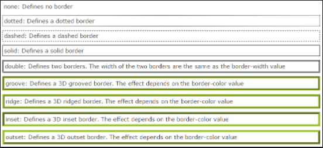
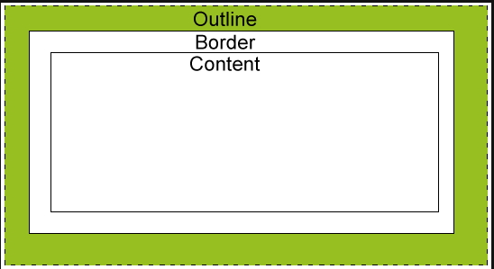

# CSS

## CSS Background

### CSS Background 효과

- background-color : 배경색넣기

- background-image : 배경에 이미지 넣기

- background-repeat : 배경이지미의 반복을 지정 4가지 사용

  - repeat : 배경이미지가 반복적으로 적용

  - repeat-x : 배경이미지가 가로방향으로만 반복적으로 적용

  - repeat-y : 배경이미지가 세로방향으로만 반복적으로 적용

  - no-repeat : 배경이미지가 반복적으로 적용되지 않고 한번만 적용

    ```css
    <style>
    body {
    	background-image:url("tree,jpg");
    	background-repeat: no-repeat;
    }
    </style>
    ```

- background-attachment : 속성은 배경 이미지를 뷰포트 내에서 고정할지, 아니면 자신의 컨테이닝 블록과 함께 크롤 할지 지정.

  ```css
  <style>
  #myDIV{
  	width: 300px;
  	height: 300px;
  	background: lightblue url("tree.jpg");
  	color: white;
  	overfolw: auto; // 스크롤에 맞춰서 배경이미지가 움직임.
  	// auto가 없으면 이미지는 고정되고 글씨만 스크롤됨
  }
  </style>
  ```

- background-position : no-repeat일때 이미지가 왼쪽 상단에 위치하는데 그위치를 변경하는 것이 background-position이다.

  ```css
  <style>
  body{
  	background-image: url("tree.jpg");
  	background-repeat: no-repeat;
  	background-position: right top;
  	margin-right: 200px;
  }
  </style>
  ```

## CSS Margin, Padding, Border, Outline


1. Margin style

   - margin-top: 100px;
   - margin-bottom: 100px;
   - margin-right: 150px;
   - margin-left: 50px;

2. Padding style

   - padding-top: 25px;
   - padding-right: 50px;
   - padding-bottom: 25px;
   - padding-left: 50px;

3. Margin/Padding 다양하게 사용법

   - margin/Padding: 25px 50px 75px 100px;
     - top margin/Padding is 25px
     - right margin/Padding is 50px
     - bottom margin/Padding is 75px
     - left margin/Padding is 100px
   - margin/Padding: 25px 50px 75px;
     - top margin/Padding is 26px
     - right and left margins/Paddings ar 50px
     - bottom margin/Padding 75px
   - margin/Padding : 25px 50px;
     - top and bottom margins/Paddings are 25px
     - right and left margins/Paddings are 50px
   - margin/Padding 25px;
     - all four margins/Paddings are 25px

4. Border Style

   - 

   - border-style : dotted solid double dashed;
     - top border is dotted
     - right border is solid
     - bottom border double
     - left border dashed
   - border-style : dotted solid double;
     - top border is dotted
     - right and left borders are solid
     - bottom border is double
   - border-style : dotted solid;
     - top and bottom borders are dotted
     - right and left borders are solid
   - border-style : dotted;
     - all four borders are dotted

5. Outline Style

   

   ```css
   <style>
   p{
   border : 1px solid red;
   outline: green dotted thick;
   }
   </style>
   ```

## CSS display

```css
display : none; // 숨김, 안보이게 함
display : inline; // contents가 있어야 보여진다. 콘텐츠 크기로 보여진다. 한줄에 여러개가 보여진다.
display : block; // 콘텐츠 크기와 상관없이 css의 width, height 사이즈로 보여준다. 한줄에 하나만 보여진다.
display: inline-block; 콘텐츠 크기와 상관업ㅇ시 css의 width,height 사이즈로 보여준다. 한줄에 여러개가 보여진다.
```

## CSS Position

```css
position : static (default) - html에 정으된 순서대로 브라우저에 자연스럽게 보여줌
position : relative - 나의 원래자리에서 상대적으로 이동
position : abosilute - 내 아이템이 담겨있는 상자에서 이동됨
position : fixed -  내 아이템이 담겨있는 상자에서 벗어나 윈도우 즉 page상에서 이동된다.
position : sticky - 원래자리에서 고정되어, 스크롤바를 이동해도 그자리에 그대로 있다
```

## CSS overflow

- overflow, overflow-x, overflow-y

- contents가 box 영역을 벗어났을때 처리되는 방법을 나타냄

  ```css
  overflow: scroll; //스크롤따라 움직임
  odverflow: hidden; // hidden 칸에만 나옴
  odverflow: auto // 칸크기와 글씨에 따라 자동적으로 맞춰짐;; ;
  ```

## CSS Float

- 문서에 사진이나 글그림을 왼쪽이나 오른쪽에 띄어서 정렬하거나 각 객체를 오른쪽이나 왼쪽으로 정렬하여 문서를 배치
- float는 left right none으로 설정 할 수 있다.
- block형 요소에만 사용된다 ex)div, p, ol, ul, table, img ..

## CSS FlexBox

- Flexbox는 box와 아이템들으 행 또는 열로 자유자재로 배치시켜주는 방법
  - display
    - 플렉스 컨테이너를 정의하면서 컨테이너의 모든 아이템에 대해 플렉스 컨테이너를 활성화 한다.
      - .container{display: flex; }
  - flex-direction
    - 플렉스 항목이 플렉스 컨테이너에 배치되는 방향을 정의한다.
    - 플렉스 항목은 주로 가로 행이나 세로 열에 배치된다.
      - .container { flex-direction: row | row-reverse | column | column-reverse; }
  - flex-wrap
    - 기본적으로 플렉스 항목은 한 줄에 맞춰진다.
    - wrap을 사용하면 여러줄에 보여지도록 할 수 있다.
      - .container { flex-wrap: nowrap | wrap | wrap-reverse; }
  - flex-flow
  - flex-direction 및 flex-wrap를 함께 플렉스 컨테이너의 기본 축과 교차 축을 정의한다.
  - 기본값은 row nowrap 이다.
    - .container { flex-flow: column wrap; }
  - justify-content
    - main 축에 따라 정렬한다.
    - 남은 여유공간을 분산할 수 있다.
  - align-items
    - 현재 라인의 교차 축을 따라 플렉스 항목이 배치되는 방식을 선언한다.
  - align-content
    - justify-content가 기본 축 내에서 개별 항목을 정렬하는 방법과 비슷하게 교차 축에 추가 공간이 있을 때 플렉스 컨테이너의 라인을 정렬한다.
