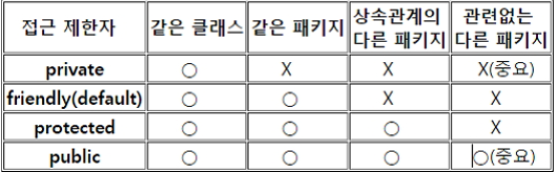

# JAVA

## 클래스(Class)와 객체

1. 클래스와 객체 비교

   ex) 자동차 도면이 클래스이고 생성된 자동차가 객체라고 생각을 하면 됨

   1. 클래스
      - 객체의 공통된 특징을 기술한 것
      - 객체의 특성과 행위를 정의
   2. 객체
      - 물리적 공간을 갖는 구체적인 것, 실체
      - 클래스의 인스턴스(실체)
      - 클래스를 구체화한 객체를 인스턴스(instance)라고 부름
      - 객체와 인스턴스는 같은 뜻으로 사용

2. 클래스의 형태

   - 필드(변수,인스턴스 변수, 멤버 변수) : 처리할 데이터를 나타냄
   - 메소드(함수, 인스턴스 메소드, 멤버 메소드): 데이터(필드, 인스턴스변수)를 처리하는 기능을 구현.

3. 클래스의 메모리 할당 (객체생성, 인스턴스 생성)

   - 하나의 클래스는 메모리 할당시 다양한 값을 가지게 되며 객체라고 부른다
   - 하나의 객체는 독릭점으로 사용된다
   - 사용 객체의 생성(참조 변수)

> class 선언
>
> ​	클래스명은 첫자는 대문자로 시작하고 파일명은 클래스명과 대소문자도 일치해야 한다
>
> ​	ex)public class DosInput { //dosInput.java로 저장
>
> ​	하나의 파일 안에 publiuc 클래스는 하나만 있을 수 있다.
>
> ​	하나의 클래스는 하나의 파일로 생성. Test.java --> Test.class

------------

성적처리 클래스 만들기

``` java
// 이름(name), 국어, 영어, 수학
// 메소드 total(), avg(), printScore()

class Score { // 클래스
  String name; // 멤버변수
  int kuk;
  int eng;
  int math;

  public int total() {
    return kuk + eng + math;
  }

  public int avg() {
    return total() / 3;
  }

  public void printScore() {
    System.out.println("이름: " + name);
    System.out.println("국어점수: " + kuk);
    System.out.println("영어점수: " + eng);
    System.out.println("수학점수: " + math);
    System.out.println("총점수: " + total());
    System.out.println("평균: " + avg());
  }

}

public class Ex01 {

  public static void main(String[] args) {
    Score s1 = new Score();

    s1.name = "홍길동";
    s1.kuk = 100;
    s1.eng = 90;
    s1.math = 100;
    s1.printScore();
  }
}
```

### String 객체의 특징

1. 한번생성된 객체는 불변이다

2. 클래스를 객체화 할때 new를 사용하지만 String은 사용하지 않아도 된다.

   ex) (String name = "홍길동");

3. 메모리상에서 같은 문자열은 공유한다.

   ex) String name = "JIH";

   ​		String str = "JIH";

   ​		name hashcode와 str hashcoe는 같다

4. 문자열은 변경할 때 ("안녕" -> "안녕하세요")는 메모리상에 "안녕"이라는 객체와 "안녕하세요"라는 객체가 둘다 존재한다.

5. 변경되는 객체가 있을 때마다 새로운 객체가 만들어진다

### 메소드 오버로딩(Method Overloading)

1. 같은 클래스 내에서 같은 이름의 메소들르 여러개 선언하는 것을 말한다.

2. 같은 이름의 메소드가 있으며 메소드가 받는 인수의 갯수와 데이터 타입을 비교하여 다르면 각각 다른 메소드로 인식을 한다

3. 메소드가 호출되는 경우 메소드의 인수의 데이터 타입과 갯구가 일치하는 메소드가 호출된다.

   ``` java
   method overloading의 대표적인 경우
   	System.out.println(1);
   	System.out.println(1.5);
   	System.out.println("한국인입니다");
   	System.out.println("IT"+"배우기");
   	
   method overloading을 사용하지 않은 경우
   	pulic void println(int x){}
   	pulic void printFloat(float x){}
   	pulic void printString(String x){}
   ↓↓↓↓↓↓↓↓↓↓↓↓
   method overloading을 적용한 경우
   	pulic void println(int x){}
   	pulic void println(float x){}
   	pulic void println(String x){}
   	
   ```

### 생성자(Constructor)

1. return Type이 없다
2. 클래스 이름과 같아야 합니다(대소문자 구별)
3. new를 이용하여 객체를 메모리에 할당한 후 할당된 메모리를 특정 값으로 초기화하는 역할을 합니다
4. 생성자가 없을때 기본 생성자를 자동으로 만들어줍니다.
5. 기본 생성자는 하는 일이 없어도 반드시 선언을 적그 권장

### static변수 (정적변수, 클래스 변수), static method(클래스 메소드)

1. 객체를 만들지 않고 변수나 메소드의 사용 가능
2. data 영역에 생성됨
3. 멤버 메소드에서는 static변수를 선어할 수 없습니다.
4. static(class) 메소드에 static 변수를 선어할 수 없습니다.

### 접근제한자(Access Modigier, 제한자, 수정자)

1. 정의 : 다른 클래스에서 현재 클래스의 필드(변수)와 메소드(함수)의 접근 가증 여부를 선언하는 기법

   - 기본적으로 변수는 모두 private선언을 구너장합니다.

   - private 으로 선언되어 있으면 다른 개발자는 접근이 불가능합니다.

   - private 변수의 처리 로직은 전부 하나의 메소드에 구현이되어  모든 개발자가 활요하게 되며 객체지향의 핵심 요소인 캡슐화(Encapsulation) 사용

   - 

     ```java
     //데이터 클래스 생성
     public class Data{ 
         //인스턴스 변수, 멤버 변수 
         private String name=null; 
         private String season=null; 
         private int year = 0; 
          
         //set으로 시작하는 메소드는 setter라고 부릅니다. 
         //set은 소문자로, 연결되는 변수명의 첫자는 대문자를 사용합니다. 
         //private변수에 값을 대입하는 목적을 가지고 있습니다. 
         //값을 저장함으로 리턴타입은 void를 이용합니다. 
         public void setName(String name){ 
             this.name = name; 
         } 
         public void setSeason(String season){ 
             this.season = season; 
         } 
         public void setYear(int year){ 
             if (year >= 20 && year <= 30){ 
                 this.year = year;  
             }else{ 
                 System.out.println("입력될 수 있는 나이는 20~30세 사이입니다."); 
             } 
         } 
          
         //get으로 시작하는 메소드는 getter라고 부릅니다. 
         //get은 소문자로, 연결되는 변수명의 첫자는 대문자를 사용합니다. 
         //private변수에서 값을 가져오는 목적을 가지고 있습니다. 
         //값을 가져옴으로 값에 따른 다양한 데이터타입을 지정합니다. 
         public String getName(){ 
             return name; 
         } 
         public String getSeason(){ 
             return season; 
         } 
         public int getYear(){ 
             return year; 
         }    
     } 
     ```

### 상속(Ingeritance)

> 상속의 경우 속성을 상속하는 경우 보다는 메소드를 상속하기 위해 많이 사용되며, 부모 클래스의 기능을 확장하는데 부모 클래스를 수정하지 않고, 부모에 구현된 로직을 사용하면서 안정적으로 클래스의 기능을 확장 할 수 있다

1. 기존에 가지고 있떤 기능을 더 확장하는 것
2. 상위(부모) 클래스 특성(필드,메소드)을 하위(자식) 클래스에 물려주는 것
3. superclass : 특성을 물려주는 상위 클래스
4. subclass : 특성을 물려 받는 하위 클래스
5. 상속은 한번에 하나의 클래스에서만 가능

- 상속 선언은 extends로 한다 (자식 클래스명 extends 부모클래스명)

#### Method overriding(오버라이딩)

1. 슈퍼 클래스의 메소드를 서브 클래스에서 재정의 하는것
2. 슈퍼클래스의 메소드 이름, 메소드 인자 타입 및 개수 , 리턴타입 등 모든 것 동일하게 정의 합니다.
3. 접근 지정자는 슈퍼 클래스의 메소드의 접근 지정자 보다 좁아질 수 없습니다.
4. static, private, 또는 final메소드는 오버라이딩 될 수 없다
5. return 타입이 다른 경우 오류 납니다.
6. 부모클래스의 메소드는 무시 됩니다.
7. overriding 기술은 부모클래스의 구기능을 없내는 것이 아니라 유지하면서 자식의 새로운 기능으로 교체하는 목적으로 사용

``` java
메소드 원형이 다름으로 오버라이딩 아닙니다.
class OverA { 
    void show(String str) { 
        System.out.println("상위클래스의 메소드 show(String str) 수행 " + str); 
    } 
} 

class SubOverA extends OverA { 
    void show() { 
        System.out.println("하위클래스의 메소드 show() 수행"); 
    } 
} 

상위 클래스와 하위 클래스의 메소드 원형이 같음으로 Method Overriding
lass OverB { 
    void show() { 
        System.out.println("부모클래스의 메소드 show()"); 
    } 

    void parent() { 
        System.out.println("부모클래스에만 있는 메소드 parent()"); 
    } 
} 

class SubOverB extends OverB { 
    //Overriding 
    void show() { 
        System.out.println("자식클래스의 메소드 show()"); 
    } 
} 
```

### 객체형변환

1. 상속 관계에서는 부모자식간에 형변환이 가능합니다.
2. 상속관계에서는 좌측에 부모클래스가 오고 우측에 자식 클래스가 올수 있습니다.
3. 실제로 메모리상에 생성되는 객체는 자식 클래스 객체와 부모클래스 객체모두 생성되고 타입만 부모클래스가 됩니다.
   - Object obj = new String("JIH");
4. 오버라이딩시에는 부모클래스 타입이더라도 자식클래스의 메소드가 호출됩니다.(동적바이딩)
5. 모든 클래스는 Object클래스를 기본적으로 상속 받습니다. 