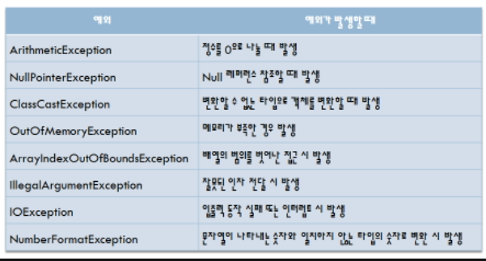
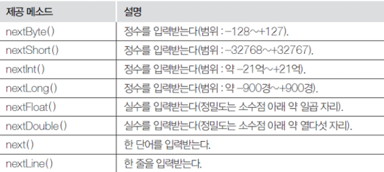

## JAVA

### 예외처리

1. 예외는 프로그램 개발시에 발생하는 에러와 다릅니다.

2. 예외처리를 하면 예외가 발생되서 프로그램이 끝나는 것이 아니라 나머지 루틴이 정상적으로 실행이 됩니다.

   ```java
   예외처리 사용법
   try{
   	예외가 발생할 가능성이 있는 실행문	
   }catch(처리할 예외 타입 선언){
   	예외 처리문(Exception e)
       e.printStackTrace();
   }finally{
   	무조건 실행해야 하는 문장, 생략 가능	
   }
   ```

   

### IO Stream

1. Stream은 연속적인 데이터 흐름을 나타냅니다.

2. 프로그램이 가지고 있는 또는 가지고 있지 않은 데이터를 외부(다른 프로그램)로 보내거나 가져오는 동작을 말합니다.

   - Program에서 처리된 데이터  -----------> 모니터, 디스크 장치,네트워크(Destination) 
                          						   출력 스트림 
   - 키보드, 디스크 장치, 네트워크 ----------> Program(Destination) 
                        						      입력 스트림 
   -  InputStream         기본 입력 스트림 클래스       Reader 
        OutputStream        기본 출력 스트림 클래스       Writer 

   1. 표준 입출력

      - 키보드로 입력하는 것을 표준입력이라고 하고, 화면 출력 하는 것을 표준출력이라고 한다.

      - 표준 출력 : System.out.printf()

      - 표준 입력 : Scanner

        - 입력을 위해 자주 사용하는 클래스이다.

          ``` java
          Sccaner s = new Scaaner(System.in);
          변수 = s.메소드()
          ```

          

          - next();를 만나면 Enter를 입력할 때까지 입력한 내용이 출력/ 띄어쓰기 하면 그 전까지만 출력 됨
          - nextLine(); 한줄 다 출력 가능 / 띄어쓰기 가능

   2. 파일 입출력

      - 파일 입출력 메소드는 입력과 출력을 파일로 처리하는 메소드이다.
      - 파일을 읽어서 내용을 입력하거나 파일에 내용을 출력한다.

   ### Collections Framework

   - 배열의 단점을 개선한 클래스로 객체만 저장할 수 있다.
   - 배열의 단점인 메모리 낭비를 피할수 있는 구조이다.
   - 동적인 크기 변경이 가능합니다.
   - 자료를 효율적으로 정리하는 것을 자료구조(Data structure)라 한다.
   - 자료구조 방법에는 Set계열, List계열, Map계열이 있다.
   - java는 java.util패키지의 자바 컬렉션(JCF)에서 자료구조 방법을 제공한다.

   1. Set

      - 순서가 없고 중복안됨

      - HashSet, TreeSet

        ```java
        HashSet set = new HashSet();
        set.add("lee");
        set.clear(); // 초기화 시켜줌
        set.add("Eden");
        
        System.out.println(set);
        System.out.println("set 사이즈 : "+ set.size());
        System.out.println(set.contains("Eden")); // true or fales로 나옴 
        set.remove("Eden");//제거하기
        //iterator는 순차적으로 하나씩 하나씩 꺼내오는거, 하나하나 접근해서 변화 처리 가능함
        System.out.println("Iterator 객체를 이용해서 set값을 출력");
        print(set.iterator());
        //배열타입으로 해서 출력
        System.out.println("배열을 이용해서 set출력");
        print(set.toArray());//업캐스팅 함
        
        //배열 이용
          private static void print(Object[] array) {
            for(int i =0; i<array.length;i++) {
              System.out.println(array[i]);
            }
            
          }
        //이터레이터 이용
          private static void print(Iterator iterator) {
            while (iterator.hasNext()) {
              String str =(String)iterator.next();
              System.out.println(str);
        ```

   2. List

      - 순서가 있고 중복이 가능하다.

      - ArrayList, LinkedList, Vector

        ```java
        import java.util.ArrayList;
        import java.util.Iterator;
        import java.util.List;
        
        public class ListTest {
        
          public static void main(String[] args) {
            //순서도 있고 중복도 가능한 리스트 구조로 만들기
            ArrayList list = new ArrayList();
            list.add("lee");
            list.clear();
            list.add("cho");
            list.add("kim");
            list.add("chung");
            list.add("min");
            list.add("chung");
            
            System.out.println(list);
            System.out.println("ArrayList사이즈:"+list.size());
            System.out.println(list.contains("chung"));//true, false
            list.remove("kim"); //데이터로 지우기
            System.out.println(list);
            list.remove(3);//순번으로도 지울수 있음
            System.out.println(list);
            System.out.println("ArrayList사이즈:"+list.size());
            
            System.out.println("min 위치값출력:"+list.indexOf("min"));
            System.out.println("---------------------");
            System.out.println("for문으로 출력:");
            
            //이터레이터나 배열을 이용하지 않고 출력 가능
            print(list);// 업캐스팅
            
            List sublist = list.subList(0, 2);
            System.out.println("sub를 사용해서 출력:");
            print(sublist); // 자기 자신, 캐스팅X
            //subString이 문자열 출력이니까, sublist도 0에서 2 사이에 있는 거 뽑아옴
            
            System.out.println("Iterator를 이용하여 출력:");
            print(list.iterator());//오버로딩
            
            System.out.println("배열을 이용해서 출력: ");
            print(list.toArray());
          }
          private static void print(Object[] array) {
            for(int i =0; i<array.length;i++) {
              System.out.println(array[i]);
              // 배열로 접근할때 사용, 업캐스팅됨
            }
          }
          private static void print(Iterator iterator) {
            while(iterator.hasNext()) {
              System.out.println(iterator.next());
              //이터레이터로 변환해서 사용
            }
          }
          private static void print(List list) {
            for(int i= 0; i<list.size();i++) {
              System.out.println(list.get(i));
              //리스트는 가지고 오는 값 get을 사용함
            }
          }
        }
        ```

      - Vactor

        ```java
        import java.util.Vector;
        
        public class SearchDelete {
        
          public static void main(String[] args) {
            String name[]= {"기획자","설계자","개발자"};
            
            Vector v = new Vector();
            
            for(int i=0; i<name.length;i++) {
              v.add(name[i]);
            }
            
            System.out.println(v);
            //개발자가 있는지 검사
            if(v.contains("개발자")) {
              int i = v.indexOf("개발자");
              System.out.println("해당 객체의 인덱스 "+(i+1)+"번째에 있다");
            }else {
              System.out.println("해당객체가 없다");
            }
            
            
            v.remove(0);// 제거
            System.out.println("-----지우고 난 후 ------");
            for(int i =0; i<v.size();i++) {
              String s = (String)v.get(i);//다운캐스팅
              System.out.println("Vector"+i+"번째 요소는"+s);
            }
            
            System.out.println("\n초기상태(capacity)과 사이즈(size)");
            System.out.println("요소의수(엘리먼트): "+v.size());
            System.out.println("Vector의 크기: "+v.capacity());
            
            System.out.println("\n---v.trimToSize()호출---------");
            v.trimToSize();
            System.out.println("요소의수(엘리먼트): "+v.size());
            System.out.println("Vector의 크기: "+v.capacity());
            //요소의 크기와 백터의 크기가 새로 들어올때 두배만큼 커진다
            
            System.out.println("\n---디자이너 요수 추가후 -----------");
            v.add("디자이너");
            System.out.println("요소의수(엘리먼트): "+v.size());
            System.out.println("Vector의 크기: "+v.capacity());
            //백터 두배로커져서 4로 변함
            
            System.out.println("\n---Coder 요수 추가후 -----------");
            v.add("Coder");
            System.out.println("요소의수(엘리먼트): "+v.size());
            System.out.println("Vector의 크기: "+v.capacity());
            //요소,벡터의 원래 크기만큼 다 차면 증가 안함
        
            System.out.println("\n---PM 요수 추가후 -----------");
            v.add("PM");
            System.out.println("요소의수(엘리먼트): "+v.size());
            System.out.println("Vector의 크기: "+v.capacity());
            //요소의 수가 증가가 되면서 백터의 크기 두배 증가
          }
        }
        ```

   3. Map

      - key, value 한쌍
      - HashMap, Hashtable
      - put 메서드로 입력합니다.
      - 중복된 키 값을 허요하지 않습니다. 만약 사용하게 되면 기존의 값이 삭제된다.
      - 검색 결과가 없으면 null을 리턴한다.

​			
