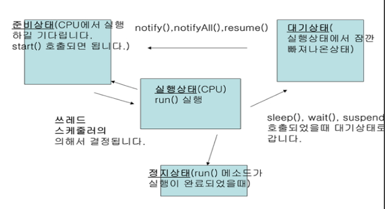

# JAVA

## 스트림 클래스

**★☆**

- 배열의 요소를 특정 기준에 따라 정렬(Sorting)하거나, 요소 중 틁정 값을 제외하고 출력하는 (filter)기능처럼 여러 자료의 처리에 대한 기능을 구현해 놓은 클래스가 스트림이다.
- 자료가 모여 있는 배열이나 컬렉션 또는 특정 범위 안에 있는 일련의 숫자를 처리하는 기능이 미리 구현되어 있어서 프로그램 코드가 훨씬 간결해지고 일관성 있게 다룰수 있다.

1. 스트림 연산

   - 스트림의 종류는 중간연산, 최종연산이 있다
   - 중간 연산은 자료를 거르거나 변경하여 또 다른 자료를 내부적으로 생성한다.
   - 최종 연산은 생성된 내부 자료를 소모해 가면서 연산을 수행한다
   - 최종 연산은 마지막에 한 번만 호출된다.

   1. 중간 연산 - filter(), map()

      - filter()는 조건을 넣고 그 조건에 맞는 참인 경우만 추출하는 경우에 사용한다.

      - 문자열 배열에서 문자열의 길이가 5이상인 경우만 출력하는 코드이다

        sList.stream().filter(s -> s.length() >5)for.Each(s -> System.out.println(s));

        스트림 생성				중간연산				최종연산

      - map()은 클래스가 가진 자료 중 이름만 출력하는 경우에 사용한다.

      - 고객 클래스에서 고객이름만 가져와서 출력한다.

      - map()은 요소들을 순회하면서 다른 형식으로 변환하기도 한다.

        customerList.stream().map(c -> c.getName()).forEach(s -> System.out.println(s));

        스트림생성								중간연산				최종연산

   2. 최종연산 - forEach(),count(),sum(),reduce()

      - 최종 연산은 스트림의 자료를 소모하면서 연산을 수행하기 때문에 최종 연산이 수행 되고 나면 해당 스트림은 더 이상 사용할 수 없다.
      - 최종 연산은 결과를 만드는 데 주로 사용한다.

2. 스트림 생성하고 사용

   1. 정수 배열에 스트림 생성하고 사용

      - 스트림을 활용해 정수 배열을 개수와 합을 출력한다.

   2. Collection에서 스트림 생성하고 사용

      - ArratList에 스트림 생성하고 활용한다.,

      - Collection인터페이스의 메소드중 stream()를 사용하면 제너릭형으로 사용해 자료형을 명시할 수 있다.

        Stream<String> steam = sList.stream();

      - 이렇게 생성된 스트림은 내부적으로 ArrayList의 모든 요소를 가지고 있다.

      - ArratList에 저장된 이름을 정렬하여 그 결과를 출력해 본다.

      ``` java
      import java.util.ArrayList;
      import java.util.List;
      import java.util.stream.Stream;
      
      public class ArrayListStreamTest {
      
        public static void main(String[] args) {
          List<String> sList = new ArrayList<String>();
          sList.add("Justin");
          sList.add("Edward");
          sList.add("Jack");
          Stream<String> stream = sList.stream();
          stream.forEach(s -> System.out.print(s + " "));
          System.out.println();
      
          sList.stream().sorted().forEach(s -> System.out.print(s + " ")); 
          // 스트림 새로 생성하여 정렬하여 출력한다.
        }
      }
      ```

## Thread

- 하나의 프로그램에서 여러개를 동시에 처리하는 기능
- 우리가 일반적으로 사용하는 프로그램은 한 프로그램에서 하나씩 순차적으로 처리되는 방식이다. 즉 작업1이 완료된 후 작업2가 처리된다
- 스레드는 작업1과 작업2가 동시에 처리될 수 있다.
- 스레드의 상태는 준비상태,실행상태,대기상태,정지상태가 있다.
- 

1. 스레드 콜백 메소드와 기본 메소드

   - strat(); 준비상태(CPU에서 실행하길 기다린다.)
   - run(); 실행상태
   - sleep(); 지정된 시간동안 스레드를 쉬게하고, 그 시간이 지나면 다시 쓰레드가 작동된다 (천 분의 1초)
   - wait(); 현재 스레드를 무한정 대기 시킨다. notify(), notifyall() 메소드를 통해서 재실행 가능
   - suspend(); 스레드의 실행을 일시적으로 중단 시킴, 다시 실행은 resume()를 통해서만 가능
   - Thread.currentThread()현재 실행중인 쓰레드를 알려준다.

2. 쓰레드 생성 방법

   - Thread 클래스 상속받는 방법

   - Runnable 인터페이스를 구현하는 방법

     - 자바는 다중 상속이 안됨으로 클래스가 특정 클래스를 상속할 필요가 있는 경우 반드시 Runnable인터페이스를 구현해야 한다.

     ``` java
     class MyThread extends Thread{ //Thread 상속 받음
       private int num;
       private String name;
       
       public MyThread(String a, int b) { //생성자
         name = a;
         num = b;        
       }
       @Override
       public void run() { //Callback메소드
         for(int i=0; i<num; i++) {
           System.out.println(name+ " : "+i);
         }
       }
     }
     
     public class ThreadTest {
     
       public static void main(String[] args) {
         MyThread t1 = new MyThread("first",100); // first : 1~100 생성
         MyThread t2 = new MyThread("second",100);// second : 1~100 생성
         MyThread t3 = new MyThread("third",100);// third : 1~100 생성
         
         t1.start();
         t2.start();
         t3.start();    
       }
     }
     ```

3. 내부 클래스를 이용하여 쓰레드 구현

   - 클래스 안에 선언되 클래스를 내부 클래스(inner class)라 한다.

   - 클래스 안에 메소드에 선언된 것을 지역 내부 클래스(local inner class)라고 한다

   - main()안에서 선언된 class는 main()메소드 안에서만 사용할 수 있고 외부에서는 사용 불가

   - 내부 클래스 컴파일된 후에 '외부클래스 이름$내부클래스이름.class'형식으로 바이트 코드가 생성된다.

     ``` java
         public static void main(String[] args) {
      
             class Car extends Thread {
                 String carName;
                 Car(String carName) {
                     this.carName = carName;
                 }
      
                 public void run() {
                     for (int i = 0; i < 3; i++) {
                         try {
                             Thread.sleep(10);
                             System.out.println(carName + "~~ 달립니다.");
                         } catch (Exception e) {
                         }
                     }
                 }
             }
             Car car1 = new Car("$자동차1");
             car1.start();
      
             Car car2 = new Car("@자동차2");
             car2.start();
      
             Car car3 = new Car("*자동차3");
             car3.start();
         }
     }
     ```