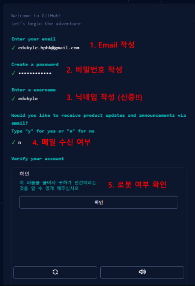
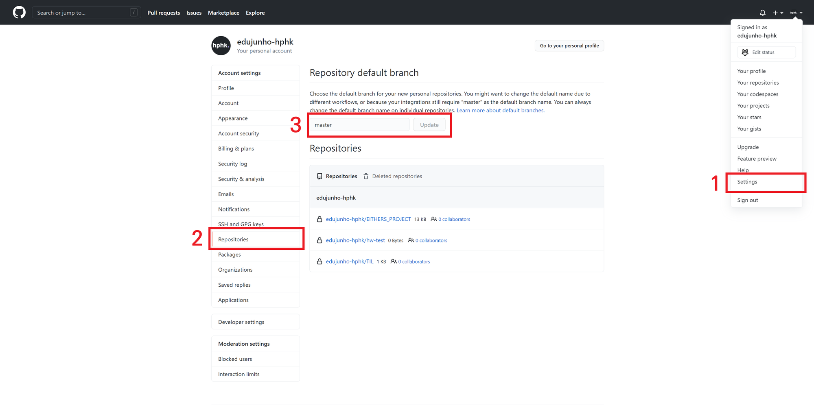
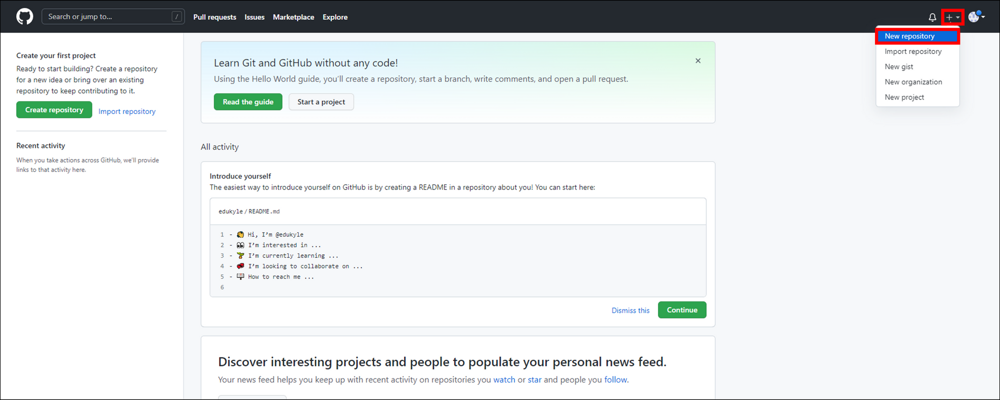
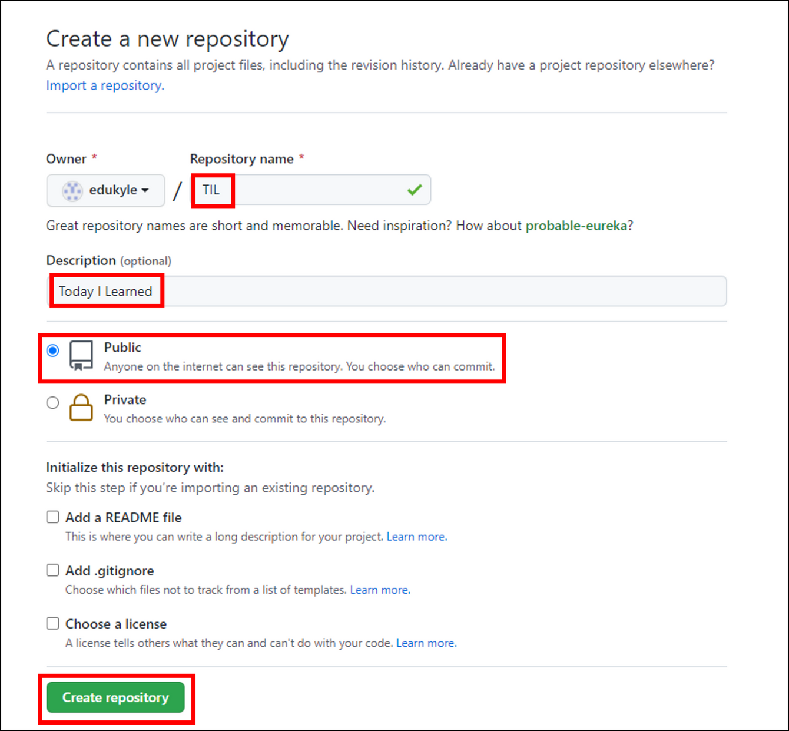
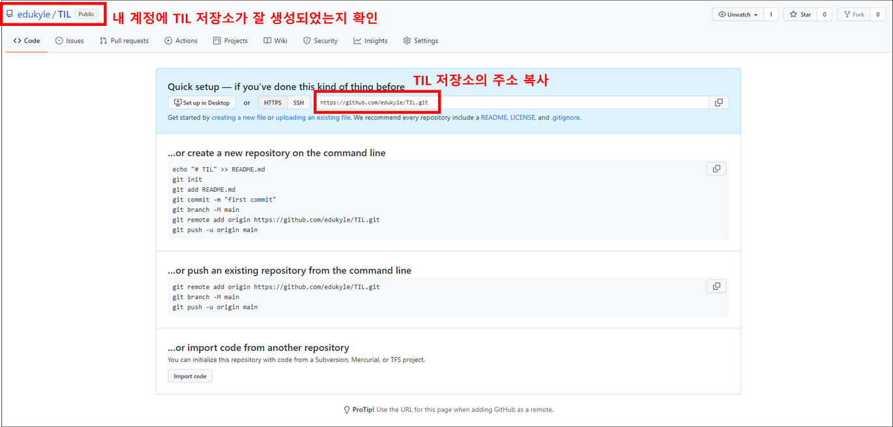

# Github, Clone,Branch

## Github시작하기

### 회원가입

[github주소](https://github.com/)

1. Github메인 페이지에 접속해서 오른쪽 상단 Sign up을 클릭
   - Email 작성 > 비밀번호 작성 > 닉네임 작성(신중!!) > 메일 수신 여부 > 로봇 여부 확인



2. Username의 경우 앞으로 개발자 인생에서 계속 쓰일 이름이기때문에 신중해야함!!!

- 이메일은 반드시 git config 설정에서 작성했던 이메일을 기입합니다!

3. 작성한 이메일로 보내진 코드를 입혁하여 인증 받습니다.
4. 간단한 설문조사가 진행됩니다. 사용에 있어 크게 중요하지 않기 때문에 빠르게 넘깁니다.
5. 위 화면이 나타나면 정상적으로 회원 가입이 완료 된 것입니다.

### Github 설정 변경

1. 오른쪽 상단 프로필을 클릭합니다.

   1. `Settings`를 클릭합니다.

   2. 왼쪽 안내 바에서 `Repositories`를 선택합니다.

   3. `Repositort default branch`의 입력 창에서 `main` 을 지우고`master`로 작성합니다.

   4. `Updata`를 클릭합니다.

      

## 원격 저장소 (Remote Repository)

여태까지는 내 컴퓨터라는 한정된 공간에 있는 로컬 저장소에서만 버전관리를 진행했습니다.

이제는 Github의 원격 저장소를 이용해 내 컴퓨터의 로컬 저장소를 다른 사람과 `공유`해봅시다.

Git의 주요 목적 중 하나인 `협업`을 위해 로컬 저장소와 원격 저장소의 연동 방법을 습득합니다.

1. Github에서 원격 저장소 생성

   

​ 화면 오른쪽 상단 더하기(+)버튼을 누르고 New repository를 클릭

​ 

​ 저장소의 이름, 설명, 공개 여부를 선택하고 Create repositort를 클릭 합니다.(체크박스는 건드리지 말기)

2. 로컬 저장소와 원격 저장소 연결

   - 원격 저장소가 잘 생성되었는지 확인 후, 저장소의 주소를 복사 합니다.

     

   - 기존에 만들었던 홈 디렉토리의 TIL 폴더로 가서 vscode를 엽니다.

   - git init을 통해 TIL 폴더를 로컬 저장소로 만들어 줍니다.

   - `git remote`

     - 로컬 저장소에 원격 저장소를 `등록, 조회, 삭제` 할 수 있는 명령어

     - 원격 저장소 등록

       - `git revote add<이름> <주소> `형식으로 작성합니다.

         ```bash
         $ git remote add origin https://github.com/In-hyeokJang/TIL.git

         [풀이]
         git 명령어를 작성할건데, remote(원격 저장소)에 add(추가) 한다.
         origin이라는 이름으로 https://github.com/In-HyeokJang/TIL.git라는 주소의 원격 저장소를
         ```

     - 원격 저장소 조회

       - `git remote -v`로 작성합니다.

         ```bash
         $ git remote -v
         origin  https://github.com/In-HyeokJang/TIL.git (fetch)
         origin  https://github.com/In-HyeokJang/TIL.git (push)


         add를 이용해 추가했던 원격 저장소의 이름과 주소가 출력됩니다.
         ```

     - 원격 저장소 연결 삭제

       `git remote rm <name> `혹은 `git remote remove <name> `으로 작성 합니다.

       로컬과 원격 저장소의 연결을 끊는 것이지, 원격 저장소 자체를 삭제하는게 아닙니다.

       ```bash
       $ git remote rm origin
       $ git remote remove origin


       [풀이]
       git 명령어를 작성할건데, remote(원격 저장소)와의 연결을 rm(remove, 삭제) 한다.
       그 원격 저장소의 이름은 origin이다.
       ```

3. 원격 저장소에 업로드

   - TIL파일을 Github 원격 저장소에 업로드 해보겠습니다.
   - **정확히 말하면, 파일을 업로드 하는게 아니라 커밋을 업로드 하는것입니다!**
   - 따라서 먼저 로컬 저장소에서 커밋을 생성해야 원격 저장소에 업로드 할 수 있습니다.

   1. 로컬 저장소에서 커밋 생성

      ```bash
      # 현재 상태 확인

      $ git status
      On branch master

      No commits yet

      Untracked files:
        (use "git add <file>..." to include in what will be committed)
              day1.md

      nothing added to commit but untracked files present (use "git add" to track)
      ```

      ```bash
      $ git add github220414.md
      ```

      ```bash
      $ git commit -m "Upload TIL Day1"
      [master (root-commit) f3d6d42] Upload TIL Day1
       1 file changed, 0 insertions(+), 0 deletions(-)
       create mode 100644 github220414.md
      ```

      ```bash
      # 커밋 확인

      $ git log --oneline
      f3d6d42 (HEAD -> master) Upload TIL Day1
      ```

   2. **git push**

      - 로컬 저장소의 커밋을 원격 저장소에 업로드하는 명령어

      - `git push <저장소이름> <브랜치이름> `형식으로 작성합니다.

      - `-u` 옵션을 사용하면, 두 번재 커밋부터는 `저장소이름, 브랜치 이름`을 생략합니다.

        ```bash
        $ git push origin master

        [풀이]
        git 명령어를 사용할건데, origin이라는 이름의 원격 저장소의 master 브랜치에 push 한다.

        ------------------------------------------------

        $ git push -u origin master
        이후에는 $ git push 라고만 작성해도 push가 됩니다.
        ```

## Clone

### 원격 저장소 가져오기

> 지금까지는 로컬 저장소의 내용을 원격 저장소에 업로드 하는 것을 학습했다면, 반대로 원격 저장소의 내용을 로컬 저장소로 가져오는 것을 학습합니다.

1. git clone

   - 원격 저장소의 커밋 내역을 모두 가져와서, 로컬 저장소를 생성하는 명령어

   - clone은 `"복제"` 라는 뜻으로, `git clone` 명령어를 사용하면 원격 저장소를 통째로 복세해서 내 컴퓨터에 옮길 수 있다.

   - `git clone<원격 저장소 주소>`의 형태로 작성합니다

     ```bash
     $ git clone https://github.com/In-HyeokJang/TIL.git
     Cloning into 'TIL'...
     remote: Enumerating objects: 3, done.
     remote: Counting objects: 100% (3/3), done.
     remote: Total 3 (delta 0), reused 3 (delta 0), pack-reused 0
     Receiving objects: 100% (3/3), done.
     ```

     위에 작성한 대로 실행ㅎ면, `Github의 In-HyeokJang라는 계정의 TIL원격 저장소를 복제`하여 내 컴퓨터에 TIL이라는 이름의 로컬 저장소를 생성하게 됩니다

   - git clone을 통해 생성된 로컬 저장소는 `git init`과 `git rmote add`가 이미 수행되어 있습니다.

### 내 컴퓨터 ↔ Github(원격 저장소) ↔ 강의장 컴퓨터

> 두 개 이상의 로컬 저장소에서 하나의 원격 저장소에 접근하면 어떻게 될까요? 집과 강의장을 오가면서 `clone, push, pull` 하는 과정을 살펴보겠습니다.

1. 규칙

- 수업 때는 두 개의 폴더를 `"내 컴퓨터"`와 `"강의장 컴퓨터"` 라고 가정합니다.
- 내 컴퓨터에 있는 로컬 저장소의 이름은 `TIL-home` 입니다.
- 강의장 컴퓨터에 있는 로컬 저장소의 이름은 `TIL-class` 입니다.
- Github에 있는 원격 저장소의 이름은 `TIL-remote` 입니다.

2. 사전 세팅

- 홈 디렉토리 안에 `TIL-home` 폴더를 생성합니다.

- Github에서 `TIL-remote` 라는 이름의 원격 저장소를 생성합니다.

- `TIL-home` 폴더에서 vscode를 엽니다.

- 아래와 같은 절차를 진행합니다.

  ```bash
  # TIL-home

  $ git init
  $ touch day1.md
  $ git add .
  $ git commit -m "집에서 Day1 작성"
  $ git remote add origin <https://github.com/edukyle/TIL-remote.git>
  $ git push origin master
  ```

  `TIL-home` 로컬 저장소의 내용이 `TIL-remote` 원격 저장소에 그대로 반영되었습니다.

3. git clone

> 여러분은 이제 강의장에 왔습니다. 강의장 컴퓨터에는 여러분의 TIL 폴더가 없습니다.

- Github에 있는 `TIL-remote`에서 `git clone`을 통해 내려 받습니다.

  ```bash
  # TIL-class

  $ git clone <https://github.com/edukyle/TIL-remote.git> TIL-class
  ```

  **원격 저장소는 `TIL-remote` 이지만, 위와 같이 작성하면 강의장 컴퓨터에는 `TIL-class`라는 이름으로 로컬 저장소가 생성됩니다. (내부 파일 내용은 똑같습니다. 단지 폴더의 이름만 바뀝니다.)**

4. git push

> 강의장 컴퓨터 → 원격 저장소

- 강의장에서 새로운 파일을 만들고 원격 저장소에 업로드 합니다.

  ```bash
  # TIL-class

  $ touch day2.md
  $ git add .
  $ git commit -m "강의장에서 Day2 작성"
  $ git push origin master
  ```

  5. git pull

> 원격 저장소 → 내 컴퓨터

- 내 컴퓨터에는 day2.md가 없습니다. 왜냐하면 강의장 컴퓨터에서 day2.md를 만들어서 원격 저장소에 push 했기 때문입니다. 따라서 원격 저장소에서 day2.md에 대한 내역을 가져와야 합니다.

  ```bash
  # TIL-home

  $ git pull origin master
  ```

  이제 `내 컴퓨터, Github, 강의장 컴퓨터`의 내용은 동일합니다.

  ## Branch

  > Git에서 Branch라는 개념은 매우 중요합니다. 사실상 버전 관리의 꽃이라고 할 수 있습니다.

  1. Branch란?

  - Branch는 `나뭇가지`라는 뜻의 영어 단어입니다.
  - 즉 `브랜치`란 나뭇가지처럼 여러 갈래로 작업 공간을 나누어 **독립적으로 작업**할 수 있도록 도와주는 Git의 도구입니다.
  - 장점
    1. 브랜치는 독립 공간을 형성하기 때문에 원본(master)에 대해 안전합니다.
    2. 하나의 작업은 하나의 브랜치로 나누어 진행되므로 체계적인 개발이 가능합니다.
    3. 특히나 Git은 브랜치를 만드는 속도가 굉장히 빠르고, 용량도 적게 듭니다.
  - 그래도 브랜치 꼭 써야하나요?
    1. 일단 master 브랜치는 상용을 의미합니다. 그래서 언제든 세상에 공개되어 있습니다.
    2. 만약 상용에 에러가 있어서 고쳐야 한다면 어떻게 해야할까요?
    3. 고객들이 사용하고 있는데, 함부로 버전을 되돌리거나 삭제할 수 있을까요?
    4. 따라서 브랜치를 통해 별도의 작업 공간을 만들고, 그곳에서 되돌리거나 삭제를 합니다.
    5. 브랜치는 완전하게 독립이 되어있어서 어떤 작업을 해도 master에는 영향을 끼치지 못하죠.
    6. 그리고 이후에 에러를 해결했다면? 그 내용을 master에 반영할 수도 있습니다!
    7. 이러한 이유 때문에 Git에서 브랜치는 정말 강력한 기능 중의 하나라고 할 수 있습니다.

  2. git branch

  > 브랜치 `조회, 생성, 삭제 등` 브랜치와 관련된 Git 명령어

  ```bash
  # 브랜치 목록 확인
  $ git branch

  # 원격 저장소의 브랜치 목록 확인
  $ git branch -r

  # 새로운 브랜치 생성
  $ git branch <브랜치 이름>

  # 특정 커밋 기준으로 브랜치 생성
  $ git branch <브랜치 이름> <커밋 ID>

  # 특정 브랜치 삭제
  $ git branch -d <브랜치 이름> # 병합된 브랜치만 삭제 가능
  $ git branch -D <브랜치 이름> # (주의) 강제 삭제 (병합되지 않은 브랜치도 삭제 가능)
  ```

  3. git switch

  > 현재 브랜치에서 다른 브랜치로 `HEAD`를 이동시키는 명령어 `HEAD`란 현재 브랜치를 가리키는 포인터를 의미합니다.

```bash
$ git switch <다른 브랜치 이름>

# 브랜치를 새로 생성과 동시에 이동
$ git switch -c <브랜치 이름>

# 특정 커밋 기준으로 브랜치 생성과 동시에 이동
$ git switch -c <브랜치 이름> <커밋 ID>
```
