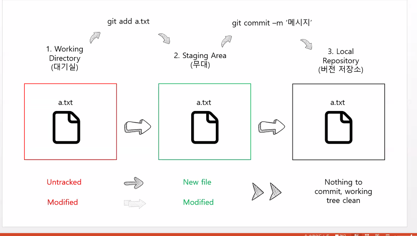

# Git&Github

## Git

1. 설치
   - [Git설치 주소](https://git-scm.com/)
   - `Downloads` 에서 사양에 맞는 파일 선택하여 다운
   - 설치파일 더블클릭하여 실행
2. 설치 확인
   - 시작 `Git Bash` 검색하여 실행
   - 터미널 창에서 `git --version` 입력하여 설치된 버전 정보가 잘 나오는지 확인

### Git 초기 설정

1. 최초 한 번만 설정합니다. 매번 Git을 사용할 대마다 설정할 필요가 없다.

   1. 누가 커밋 기록을 남겼는지 확인 할 수 있도록 이름과 이메일을 설정 한다.

   2. 작성자를 수정하고 싶을 때에는 이름, 메일 주소만 다르게 하여 동일하게 입력 한다.

      ```bash
      $ git config --global user.name"이름"
      $ git config --global user.email "메일주소"
      ```

   3. 작성자가 올바르게 설정되었는지 확인

      ```bash
      $ git config --global -l
      또는
      $ git congig --global --list
      ```

### Git?

- **Git이란?**
  - 분산 버전 관리 시스템.
  - **Working Directory → Staging Area → Repository** 의 과정으로 버전 관리 수행
    - `Working Directory(=Working Tree)` : 사용자의 일반적인 작업이 일어나는 곳
    - `Staging Area(=Index)` : 사용자의 일반적인 작업이 일어나는 곳
    - `Repository` : 사용자의 일반적인 작업이 일어나는 곳

- **Git명령어**

  1. git init

     ```bash
     $ git init
     Initialized empty Git repository in C:/Users/kyle/git-practice/.git/
     ```

     - 현재 작업중인 디렉토리를 Git으로 관리 한다는 명령어

     - `.git`이라는 숨김 폴더를 생성하고, 터미널에는 `(master)`라고 표기 된다

       **주의사항**

       1. 터미널에 이미 (master)가 있다면, git init을 덜대 입력하면 안됨
       2. 절대로 홈 디렉토리에서 git init을 하지 않습니다. 터미널의 경로가 `~`인지 확인합니다.

  2. git status

     - ```bash
       $ git status
       On branch master
       
       No commits yet
       
       nothing to commit (create/copy files and use "git add" to track)
       ```

     - Working Directory와 Staging Area에 있는 파일의 현재 상태를 알려주는 명령어

     - 어떤 작업을 시행하기 전에 수시로 status를 확인하면 좋다

     - 상태

       1.`Untracked` : Git이 관리하지 않는 파일(한번도 staging Area에 올라간 적 없는 파일)

       2.`Tracked` : Git이 관리 하는 파일

       ​	a. `Unmodified` : 최신 상태

       ​	b. `Modified` : 수정되었지만 아직 Staging Area에는 반영하지 않은 상태

       ​	c. `Staged` : Staging Area에 올라간 상태

       

  3. git add

     ```bash
     # 특정 파일
     $ git add a.txt
     
     # 특정 폴더
     $ git add my_folder/
     
     # 현재 디렉토리에 속한 파일/폴더 전부
     $ git add .
     ```

     