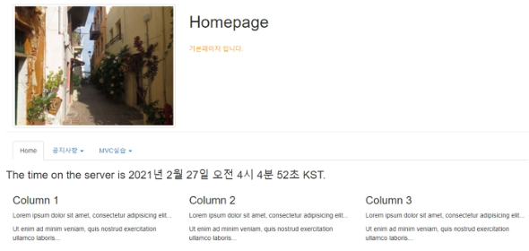

# SpringBoot으로 게시판 만들기

> 내용정리..틀린부분 있을수도 있음 다시 확인 필요
>
> [1. spring 설정 bbs homepage만들기](#springboot으로-게시판-만들기)

---

> [1. 게시판 목록](#게시판-목록-만들기) > [2. 생성](#생성등록) > [3. 생성한거 읽기(조회)](#생성한거-읽기조회) > [4. 수정](#수정) > [5. 삭제](#삭제) > [6. 답변](#답변)

---

1. spring- tool-sts 켜기

2. Spring Starter Project 실행

3. Name : Spring_bbs

   Type : Gradle

   Packaging : War

   Java Version : 11

   Language : Java

   Group : com.study.bbs

   Artifact : bbs

   Package : com.study.bbs 후 next 하여 mysql 사용시 드라이버 선택

4. Spring Boot DevTools, JDBC API, MyBatis Framework, Spring Web 선택

5. build.gradle, application.properties 설정

   - jsp사용을 위한 의존성 추가

   - Annotation 기반 Form검증 validation 의존성 추가

     ->**Gradle -> Refresh Gradle Project 꼭 하기**

     ```Soring
       >>> build.gradle 추가

       // https://mvnrepository.com/artifact/org.apache.tiles/tiles-jsp
     implementation group: 'org.apache.tiles', name: 'tiles-jsp', version: '3.0.8'
     ```

6. 서포트 변경

   - JSP view path
   - mysql설정, Conntion pool설정

   ```Spring
   >>> application.properties

   server.port=8000
   # DEVTOOLS (DevToolsProperties)
   spring.devtools.livereload.enabled=true
   #jsp설정
   spring.mvc.view.prefix=/WEB-INF/views/
   spring.mvc.view.suffix=.jsp
   ```

7. Component scan 패키지 설정

   ```
   >>> SpringBbsApplication.java
   package com.study.bbs;

   import org.springframework.boot.SpringApplication;
   import org.springframework.boot.autoconfigure.SpringBootApplication;
   import org.springframework.context.annotation.ComponentScan;

   @SpringBootApplication
   @ComponentScan(basePackages= {"com.study.*"})
   public class SpringBbsApplication {

   	public static void main(String[] args) {
   		SpringApplication.run(SpringBbsApplication.class, args);
   	}

   }
   ```

8. JSP Views, images 폴더 생성

   1. jsp views
      - /src/main/폴더에 webapp/WEB-INF/views 생성

9. TilesConfiguration 클래스 생성

- TilesViewResolver 생성 및 layout xml 위치 지정

  src/main/java -> com.study.bbs > TilesConfiguration.java클래스 생성

  ```Spring
  >>> TilesConfiguration.java
  package com.study.bbs;

  import org.springframework.context.annotation.Bean;
  import org.springframework.context.annotation.Configuration;
  import org.springframework.web.servlet.view.tiles3.TilesConfigurer;
  import org.springframework.web.servlet.view.tiles3.TilesView;
  import org.springframework.web.servlet.view.tiles3.TilesViewResolver;

  @Configuration
  public class TilesConfiguration {
    @Bean
    public TilesConfigurer tilesConfigurer() {
        final TilesConfigurer configurer = new TilesConfigurer();
        //해당 경로에 tiles.xml 파일을 넣음
        configurer.setDefinitions(new String[]{"classpath:/tiles/tiles.xml"});
        configurer.setCheckRefresh(true);
        return configurer;
    }

    @Bean
    public TilesViewResolver tilesViewResolver() {
        final TilesViewResolver tilesViewResolver = new TilesViewResolver();
        tilesViewResolver.setViewClass(TilesView.class);
        return tilesViewResolver;
    }
  }
  ```

10. layout설정 파일 생성

    - /src/main/resources ->template폴더에 > tiles.xml생성

      ```Spring
      >>> tiles.xml
      <?xml version="1.0" encoding="UTF-8" ?>
      <!DOCTYPE tiles-definitions PUBLIC
             "-//Apache Software Foundation//DTD Tiles Configuration 3.0//EN"
             "http://tiles.apache.org/dtds/tiles-config_3_0.dtd">

      <tiles-definitions>
        <!-- main -->
        <definition name="main"
          template="/WEB-INF/views/template/template.jsp">
          <put-attribute name="header"
            value="/WEB-INF/views/template/top.jsp" />
        </definition>
        <definition name="/home" extends="main">
          <put-attribute name="title" value="기본페이지"></put-attribute>
          <put-attribute name="body"
            value="/WEB-INF/views/index.jsp" />
        </definition>

      </tiles-definitions>
      ```

    - mvc_bbs의 template폴더 및 index.jsp를 /WEB-INF/views/로 복사

      ```spring
      >>> /WEB-INF/views/template/template.jsp

      <%@ page contentType="text/html; charset=UTF-8" %>
      <%@ taglib uri="http://tiles.apache.org/tags-tiles" prefix="tiles"%>
      <html>
      <head>
      <title><tiles:getAsString name="title"/></title>
      </head>
      <body>
          <tiles:insertAttribute name="header"></tiles:insertAttribute>
          <tiles:insertAttribute name="body"></tiles:insertAttribute>

      </body>
      </html>

      >>> /WEB-INF/views/template/top.jsp
      <%@ page contentType="text/html; charset=UTF-8" %>
      <%
      request.setCharacterEncoding("utf-8");
      String root = request.getContextPath();

      %>
      <!DOCTYPE html>
      <html>
      <head>
        <title>bbs</title>
        <meta charset="utf-8">
        <meta name="viewport" content="width=device-width, initial-scale=1">
        <link rel="stylesheet" href="https://maxcdn.bootstrapcdn.com/bootstrap/3.4.0/css/bootstrap.min.css">
        <script src="https://ajax.googleapis.com/ajax/libs/jquery/3.5.1/jquery.min.js"></script>
        <script src="https://maxcdn.bootstrapcdn.com/bootstrap/3.4.0/js/bootstrap.min.js"></script>
        <style type="text/css">
        #grade{

         color : orange;
        }
        </style>
      </head>
      <body>
      <!--상단메뉴-->
      <div class="container">

        <div class="page-header row">
         <div class="col-sm-4">
          /images/img_chania.jpg" class="img-responsive img-thumbnail" alt="Cinque Terre" >
         </div>
         <div class="col-sm-8"><h1>Homepage</h1><br>

         <p id="grade">기본페이지 입니다.</p>

         </div>
        </div>
        <ul class="nav nav-tabs">
          <li class="active"><a href="<%=root%>/">Home</a></li>

          <li class="dropdown">
            <a class="dropdown-toggle" data-toggle="dropdown" href="#">게시판<span class="caret"></span></a>
            <ul class="dropdown-menu">
              <li><a href="<%=root %>/bbs/list">게시판 목록</a></li>
              <li><a href="<%=root %>/bbs/create">게시판 생성</a></li>
            </ul>
          </li>
          <li class="dropdown">
            <a class="dropdown-toggle" data-toggle="dropdown" href="#">MVC실습 <span class="caret"></span></a>
            <ul class="dropdown-menu">
              <li><a href="#">#</a></li>
              <li><a href="#">#</a></li>
            </ul>
          </li>
        </ul>
      </div>
      </body>
      </html>
      ```

    - template/images/ 내용을 static/images/로 복사

11. Controller, View

    ```spring
    >>>BbsController.java
    package com.study.controller;

    import java.text.DateFormat;
    import java.util.Date;
    import java.util.Locale;
    import org.springframework.ui.Model;
    import org.springframework.stereotype.Controller;
    import org.springframework.web.bind.annotation.GetMapping;

    @Controller
    public class BbsController {

      @GetMapping("/")
      public String home(Locale locale, Model model) {
        Date date = new Date();
        DateFormat dateFormat = DateFormat.getDateTimeInstance(DateFormat.LONG, DateFormat.LONG, locale);

        String formattedDate = dateFormat.format(date);

        model.addAttribute("serverTime", formattedDate );
        return "/home";
      }
    }

    >>> views/insex.jsp

    <%@ page contentType="text/html; charset=UTF-8" %>

    <!DOCTYPE html>
    <html>
    <head>
      <title>기본페이지</title>
      <meta charset="utf-8">
    </head>
    <body>

    <div class="container">
    <h3>  The time on the server is ${serverTime}. </h3>
    <div class="row">
        <div class="col-sm-4">
          <h3>Column 1</h3>
          <p>Lorem ipsum dolor sit amet, consectetur adipisicing elit...</p>
          <p>Ut enim ad minim veniam, quis nostrud exercitation ullamco laboris...</p>
        </div>
        <div class="col-sm-4">
          <h3>Column 2</h3>
          <p>Lorem ipsum dolor sit amet, consectetur adipisicing elit...</p>
          <p>Ut enim ad minim veniam, quis nostrud exercitation ullamco laboris...</p>
        </div>
        <div class="col-sm-4">
          <h3>Column 3</h3>
          <p>Lorem ipsum dolor sit amet, consectetur adipisicing elit...</p>
          <p>Ut enim ad minim veniam, quis nostrud exercitation ullamco laboris...</p>
        </div>
      </div>
    </div>
    </body>
    </html>
    ```

### 기본 홈페이지 생성 후 등록된 시간 날짜



## 게시판 목록 만들기

1. BbsController.java에서 list목록 만들기

   ```java
   @GetMapping("/bbs/list") //get방식으로 전달
     public String list(HttpServletRequest request) { //메소드 선언
       String col = Utility.checkNull(request.getParameter("col"));
       String word = Utility.checkNull(request.getParameter("word"));

       if (col.equals("total")) {
         word = "";
       }
       // 페이징 관련---------------
       int nowPage = 1;
       if (request.getParameter("nowPage") != null) {
         nowPage = Integer.parseInt(request.getParameter("nowPage"));
       }

       int recordPerPage = 5;

       int sno = ((nowPage - 1) * recordPerPage);
       int eno = recordPerPage;

       Map map = new HashMap();
       map.put("col", col);
       map.put("word", word);
       map.put("sno", sno);
       map.put("eno", eno);


       List<BbsDTO> list = dao.list(map);
       int total = dao.total(map);
       String paging = Utility.paging(total, nowPage, recordPerPage, col, word);

       //2. request 저장

       request.setAttribute("list",list);
       request.setAttribute("paging",paging);
       request.setAttribute("col",col);
       request.setAttribute("word",word);
       request.setAttribute("nowPage",nowPage);

       return "/list"; //view list로 이동
     }
   ```

2. tiles.xml 에서 게시판목록 만들기

   ```java
     <definition name="/list" extends="main">
       <put-attribute name="title" value="게시판목록"></put-attribute>
       <put-attribute name="body"
         value="/WEB-INF/views/list.jsp" />
     </definition>
   ```

3. list.jsp 만들기

   ```java
   javajavajavajavajavajavajavajavajavajava<%@ page contentType="text/html; charset=UTF-8" %>
   <%@ page import="java.util.*, com.study.model.BbsDTO, com.study.utility.*" %>
   <%
   //Action에서 저장한 model결과 및 JSP에서 사용할 내용을꺼내온다.
   String col = (String)request.getAttribute("col");
   String word =(String)request.getAttribute("word");
   int nowPage = (int)request.getAttribute("nowPage");
   List<BbsDTO> list = (List<BbsDTO>)request.getAttribute("list");
   String paging =(String)request.getAttribute("paging");
   %>
   <!DOCTYPE html>
   <html>
   <head>
     <title>homepage</title>
     <meta charset="utf-8">
     <script type="text/javascript">
     <!--read 함수 선언(JS)-->
     	function read(bbsno){
     	   let url = 'read/'+bbsno;
     	   location.href = url;
     	}
     </script>
   </head>
   <body>
   <div class="container">
   <h1 class="col-sm-offset-2 col-sm-10">게시판 목록</h1>
   <form action="list" class='form-inline'>
   <div class='form-group'>
    <select class='form-control' name='col'>
    	<option value="wname" <%if(col.equals("wname")) out.print("selected");%>>성명</option>
    	<option value="title" <%if(col.equals("title")) out.print("selected");%>>제목</option>
    	<option value="content" <%if(col.equals("content")) out.print("selected");%> >내용</option>
    	<option value="title_content" <%if(col.equals("title_content")) out.print("selected");%>>제목+내용</option>
    	<option value="total" <%if(col.equals("total")) out.print("selected");%>>전체출력</option>
    </select>
   </div>
   <div class="form-group">
   	<input type='text' class='form-control' placeholder='Enter 검색어' name='word' value="<%=word%>">
   </div>
   <button class='btn btn-default'>검색</button>
   <button class='btn btn-default' type='button' onclick="location.href='create'">등록</button>
   </form>
   <table class="table table-striped">
   	<thead>
   		<tr>
   			<th>번호</th>
   			<th>제목</th>
   			<th>작성자</th>
   			<th>등록날짜</th>
   			<th>grpno</th>
   			<th>indent</th>
   			<th>ansnum</th>
   		</tr>
   	</thead>
   	<tbody>
   <%  if(list.size()==0){ %>
   	<tr><td colspan='7'>등록된 글이 없습니다.</td></tr>

   <%  }else {
   		for(int i=0 ; i < list.size() ; i++) {
   	   	BbsDTO dto = list.get(i);
   %>
   		<tr>
   			<td><%=dto.getBbsno() %></td>
   			<td>
   				<%
   					for(int j=0; j<dto.getIndent() ; j++){
   						out.print("&nbsp;&nbsp;");
   					}//들여쓰기
   				    if(dto.getIndent() > 0) out.print(""); //re이미지
   				%>
   			<a href="javascript:read('<%=dto.getBbsno() %>')"><%=dto.getTitle() %></a>
   			<% if(Utility.compareDay(dto.getWdate())){ %>
   				
   			<% } %>
   			</td>
   			<td><%=dto.getWname() %></td>
   			<td><%=dto.getWdate() %></td>
   			<td><%=dto.getGrpno() %></td>
   			<td><%=dto.getIndent() %></td>
   			<td><%=dto.getAnsnum() %></td>
   		</tr>
   <%     } //for end
       } //if end
   %>
   	</tbody>
   </table>
   <div>
   	<%=paging %>
   </div>
   </div>
   </body>
   </html>
   ```

## 생성(등록)

1. BbsController.java에서 create만들기

   ```java
   @GetMapping("/bbs/create") //get방식으로 받아올거기 때문에 @GetMapping 사용
     public String create() //메소드
       return "/create"; // /create로 리턴
     }
     @PostMapping("/bbs/create") // /create에서 post방식으로 액션 되어서 postmapping으로 받아준다.
     public String create(BbsDTO dto) { //BbsDTO에서 가져와 받아온다?

       boolean flag = dao.create(dto); //boolean타입으로 설정 후 true면 list목록으로 아니면 error 코드로 return
       if(flag) {
         return "redirect:list";
       }else {
         return "error";
       }
     }
   ```

2. tiles.xml에서 create받을거 생성

   ```java
   <definition name="/create" extends="main">
       <put-attribute name="title" value="생성"></put-attribute>
       <put-attribute name="body"
         value="/WEB-INF/views/createForm.jsp" />
     </definition>
   ```

3. Views폴더에서 createForm.jsp생성

   ```java
   <%@ page contentType="text/html; charset=UTF-8" %>

   <!DOCTYPE html>
   <html>
   <head>
     <title>homepage</title>
     <meta charset="utf-8">
   </head>
   <body>
   <div class="container">
   <h1 class="col-sm-offset-2 col-sm-10">게시판 생성</h1>
   <form class="form-horizontal"
         action="create" //create로 받아오는거 변경 중요
         method="post"
         >

     <div class="form-group">
       <label class="control-label col-sm-2" for="wname">작성자</label>
       <div class="col-sm-6">
         <input type="text" name="wname" id="wname" class="form-control">
       </div>
     </div>
     <div class="form-group">
       <label class="control-label col-sm-2" for="title">제목</label>
       <div class="col-sm-6">
         <input type="text" name="title" id="title" class="form-control">
       </div>
     </div>

     <div class="form-group">
       <label class="control-label col-sm-2" for="content">내용</label>
       <div class="col-sm-6">
       <textarea rows="5" cols="5" id="content" name="content" class="form-control"></textarea>
       </div>
     </div>

    <div class="form-group">
       <label class="control-label col-sm-2" for="passwd">비밀번호</label>
       <div class="col-sm-6">
         <input type="password" name="passwd" id="passwd" class="form-control">
       </div>
     </div>

      <div class="form-group">
      <div class="col-sm-offset-2 col-sm-5">
       <button class="btn">등록</button>
       <button type="reset" class="btn">취소</button>
      </div>
    </div>
   </form>
   </div>
   </body>
   </html>
   ```

## 생성한거 읽기(조회)

1. BbsController.java에서 read 만들기

   ```java
     @GetMapping("bbs/read/{bbsno}") //{bbsno}는 몇번째꺼 읽어오는지 정하기 위해서 사용
     public String read(@PathVariable int bbsno ,Model model) {
       dao.upViewcnt(bbsno);
       //@PathVariable - Parameter를 URL형식으로 받기
       //Model은 mvc에서 request에 저장했었던 거다 생각 하면 됨

       model.addAttribute("dto",dao.read(bbsno));
       // 그래서 model에 dao.read(bbsno)를 받아서 dto에 기입하고 model에 저장한는 느낌?

       return "/read"; // /read로 view 해주는 tiles.xml로 가는거 같음
     }
   ```

2. tiles.xml에서 조회 만들기

   ```java
     <definition name="/read" extends="main">
       <put-attribute name="title" value="조회"></put-attribute>
       <put-attribute name="body"
         value="/WEB-INF/views/read.jsp" />
     </definition>
   ```

3. Views 폴더에 read.jsp생성

   ```java
   <%@ page contentType="text/html; charset=UTF-8" %>
   <%@ // spring에서 model이 com.strudy.model.*안에 있어 이거로 import해줌%>
   <%@ page import="com.study.model.*" %>
   <%
   	BbsDTO dto = (BbsDTO)request.getAttribute("dto");
   	//dto에 저장한걸 여기서 받아온걸 다시 BbsDTO dto에 저장하나?
   %>
   <!DOCTYPE html>
   <html>
   <head>
     <title>homepage</title>
     <meta charset="utf-8">
     <script>
     	function update(){ //수정페이지로 이동
     		let url = '/bbs/update/<%=dto.getBbsno()%>';
     		location.href = url;
     	}
     	function del(){//삭제페이지로 이동
     		let url = '/bbs/delete/<%=dto.getBbsno()%>';
     		location.href = url;
     	}
     	function reply(){//답변페이지로 이동
     		let url = '/bbs/reply/<%=dto.getBbsno()%>';
     		location.href = url;
     	}
     </script>
   </head>
   <body>
   <div class="container">
   <h1>조회</h1>
   <div class="panel panel-default">
   	<div class="panel-heading">작성자</div>
   	<div class="panel-body"><%=dto.getWname() %></div>
   	<div class="panel-heading">제목</div>
   	<div class="panel-body"><%=dto.getTitle() %></div>
   	<div class="panel-heading">내용</div>
   	<div class="panel-body" style='height:170px'><%=dto.getContent() %></div>
   	<div class="panel-heading">조회수</div>
   	<div class="panel-body"><%=dto.getViewcnt() %></div>
   	<div class="panel-heading">등록일</div>
   	<div class="panel-body"><%=dto.getWdate() %></div>
   </div>
   <div>
   	<button onclick="location.href='/bbs/create'">등록</button>
   	<button onclick="update()">수정</button>
   	<button onclick="del()">삭제</button>
   	<button onclick="reply()">답변</button>
   	<button onclick="location.href='/bbs/list'">목록</button>
   </div>
   <br>
   </div>
   </body>
   </html>
   ```

## 수정

1. BbsController.java에 update 생성 passcheck필요

   ```java
    @GetMapping("/bbs/update/{bbsno}")//{bbsno}는 몇번째꺼 읽어오는지 정하기 위해서 사용
     public String update(@PathVariable int bbsno, Model model) {
         //@PathVariable - Parameter를 URL형식으로 받기 bbsno를 int로 바꿔서 받아온다?
       //Model은 mvc에서 request에 저장했었던 거다 생각 하면 됨
       model.addAttribute("dto",dao.read(bbsno));
         //dao의 read에서 bbsno를 읽어와 dto에 기입후 model저장
       return "/update"; // /update가 있는 곳으로 이동
     }

     @PostMapping("/bbs/update") // post방식의 url주소
     public String update(BbsDTO dto) { //메소드
       Map map = new HashMap(); // map객체 생성 후 담아주기
       map.put("bbsno", dto.getBbsno());
       map.put("passwd", dto.getPasswd());
       boolean pflag = dao.passCheck(map);
       boolean flag = false;

       if(pflag) flag = dao.update(dto);

       if(!pflag) return "passwdError";
       else if(!flag) return "error";
       else {
         return "redirect:list";
       }
     }
   ```

2. tiles.xml에 수정 등록

   ```java
      <definition name="/update" extends="main">
       <put-attribute name="title" value="수정"></put-attribute>
       <put-attribute name="body"
         value="/WEB-INF/views/updateForm.jsp" />
     </definition>
   ```

3. updateForm 생성

   ```java
   <%@ page contentType="text/html; charset=UTF-8" %>

   <!DOCTYPE html>
   <html>
   <head>
     <title>homepage</title>
     <meta charset="utf-8">
   </head>
   <body>
   <div class="container">
   <h1 class="col-sm-offset-2 col-sm-10">게시판 생성</h1>
   <form class="form-horizontal"
         action="create"
         method="post"
         >

     <div class="form-group">
       <label class="control-label col-sm-2" for="wname">작성자</label>
       <div class="col-sm-6">
         <input type="text" name="wname" id="wname" class="form-control">
       </div>
     </div>
     <div class="form-group">
       <label class="control-label col-sm-2" for="title">제목</label>
       <div class="col-sm-6">
         <input type="text" name="title" id="title" class="form-control">
       </div>
     </div>

     <div class="form-group">
       <label class="control-label col-sm-2" for="content">내용</label>
       <div class="col-sm-6">
       <textarea rows="5" cols="5" id="content" name="content" class="form-control"></textarea>
       </div>
     </div>

    <div class="form-group">
       <label class="control-label col-sm-2" for="passwd">비밀번호</label>
       <div class="col-sm-6">
         <input type="password" name="passwd" id="passwd" class="form-control">
       </div>
     </div>

      <div class="form-group">
      <div class="col-sm-offset-2 col-sm-5">
       <button class="btn">등록</button>
       <button type="reset" class="btn">취소</button>
      </div>
    </div>
   </form>
   </div>
   </body>
   </html>
   ```

## 삭제

1. BbsController.java에 delete 생성 passcheck필요

   ```java
     @PostMapping("/bbs/delete")
     public String delete(@RequestParam Map<String,String> map) {
       //@RequestParam - Form페이지에서 넘어오는 파라메터를 받을 수 있다.
       // 문자열만 옴
       int bbsno = Integer.parseInt(map.get("bbsno"));
         //그래서 Integer.parseInt로 형변환 해줘야함
       boolean pflag = dao.passCheck(map);
       boolean flag = false;
       if(pflag)flag = dao.delete(bbsno);

       if(!pflag)return "passwdError"; //비밀번호 오류일때 비밀오류 페이지를 보여준다.
       else if(!flag)return "error";
       else return "redirect:list";
     }

     @GetMapping("/bbs/delete/{bbsno}")
     public String delete(@PathVariable int bbsno, Model model) {
       model.addAttribute("bbsno", bbsno);
       return "/delete";
     }
   ```

2. tiles.xml에 삭제 등록

   ```java
      <definition name="/delete" extends="main">
       <put-attribute name="title" value="삭제"></put-attribute>
       <put-attribute name="body"
         value="/WEB-INF/views/deleteForm.jsp" />
     </definition>
   ```

3. deleteForm 생성

   ```java
   <%@ page contentType="text/html; charset=UTF-8" %>

   <!DOCTYPE html>
   <html>
   <head>
     <title>homepage</title>
     <meta charset="utf-8">
     <style type="text/css">
      #red{
      	color : red;
      }
     </style>
   </head>
   <body>
   <div class="container">
   <h1 class="col-sm-offset-2 col-sm-10">삭제</h1>
   <form class="form-horizontal"
         action="/bbs/delete"
         method="post"
         >

     <input type="hidden" name="bbsno" value="<%=request.getAttribute("bbsno") %>">
     <div class="form-group">
       <label class="control-label col-sm-2" for="passwd">비밀번호</label>
       <div class="col-sm-6">
         <input type="password" name="passwd" id="passwd" class="form-control">
       </div>
     </div>

     <p id="red" class="col-sm-offset-2 col-sm-6">삭제하면 복구할 수 없습니다.</p>

      <div class="form-group">
      <div class="col-sm-offset-2 col-sm-5">
       <button class="btn">삭제</button>
       <button type="reset" class="btn">취소</button>
      </div>
    </div>
   </form>
   </div>
   </body>
   </html>
   ```

## 답변

1. BbsController.java에 reply 생성

   ```java
     @PostMapping("/bbs/reply")
     public String reply(BbsDTO dto) { //메소드
       Map map = new HashMap(); // 객체 생성
       map.put("grpno", dto.getGrpno());
       map.put("ansnum", dto.getAnsnum());
       dao.upAnsnum(map);

       if(dao.createReply(dto)) {
         return "redirect:list";
       }else {
         return "error";
       }
     }

     @GetMapping("/bbs/reply/{bbsno}")
     public String reply(@PathVariable int bbsno, Model model) {

       model.addAttribute("dto",dao.readReply(bbsno));

       return "/reply";
     }
   ```

2. tiles.xml에 답변 등록

   ```java
     <definition name="/reply" extends="main">
       <put-attribute name="title" value="답변"></put-attribute>
       <put-attribute name="body"
         value="/WEB-INF/views/replyForm.jsp" />
     </definition>
   ```

3. replyForm 생성

   ```java
   <%@ page contentType="text/html; charset=UTF-8" %>
   <%@ page import="com.study.model.*" %>
   <%
   	BbsDTO dto = (BbsDTO)request.getAttribute("dto"); //부모의 grpno, indent, ansnum
   %>
   <!DOCTYPE html>
   <html>
   <head>
     <title>homepage</title>
     <meta charset="utf-8">
   </head>
   <body>
   <div class="container">
   <h1 class="col-sm-offset-2 col-sm-10">게시판 답변</h1>
   <form class="form-horizontal"
         action="/bbs/reply"
         method="post"
         >

     <input type='hidden' name='bbsno' value="<%=dto.getBbsno() %>">
     <input type='hidden' name='grpno' value="<%=dto.getGrpno() %>">
     <input type='hidden' name='indent' value="<%=dto.getIndent() %>">
     <input type='hidden' name='ansnum' value="<%=dto.getAnsnum() %>">
     <div class="form-group">
       <label class="control-label col-sm-2" for="wname">작성자</label>
       <div class="col-sm-6">
         <input type="text" name="wname" id="wname" class="form-control">
       </div>
     </div>
     <div class="form-group">
       <label class="control-label col-sm-2" for="title">제목</label>
       <div class="col-sm-6">
         <input type="text" name="title" id="title" class="form-control" value="<%=dto.getTitle()%>">
       </div>
     </div>

     <div class="form-group">
       <label class="control-label col-sm-2" for="content">내용</label>
       <div class="col-sm-6">
       <textarea rows="5" cols="5" id="content" name="content" class="form-control"></textarea>
       </div>
     </div>

    <div class="form-group">
       <label class="control-label col-sm-2" for="passwd">비밀번호</label>
       <div class="col-sm-6">
         <input type="password" name="passwd" id="passwd" class="form-control">
       </div>
     </div>

      <div class="form-group">
      <div class="col-sm-offset-2 col-sm-5">
       <button class="btn">등록</button>
       <button type="reset" class="btn">취소</button>
      </div>
    </div>
   </form>
   </div>
   </body>
   </html>
   ```
