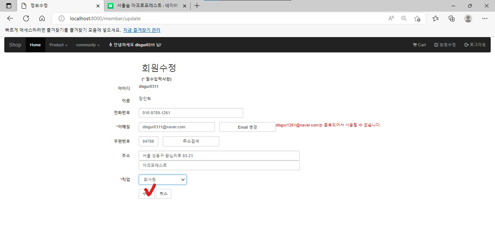

# 📖SemiProject - MLP

## 👓shopping mall 구현하기

---

멀티캠퍼스 AI플랫폼을 활용한 웹 서비스 개발 15회차

세미프로젝트 shopping mall 만들기

수업시간에 공부한 자료를 통해서 개인 세미프로젝트로 쇼핑몰 사이트 구현하기!

기간 : 22-06-20 ~ 22-06-22

발표 : 22-06-27 - 개인 PPT or README 활용해서 발표

---

### 1. 사용 코드 기술 🔨

1. 사용코드

   - Java (STS)
   - HTML / CSS / JavaScript
   - MySQL
   - Spring Boot / MyBatis
   - Windows 10

---

### 2. 기능 📽

- 회원가입
- 로그인페이지
  - id / pw 찾기 페이지 구현(fetch를 사용하여 비동기 통신으로 받아와서 구현)
- 회원 정보 수정
- Mypage
  - 이미지 수정기능
- 상품 보기
  - 상세페이지(리뷰 , 장바구니, 구매)만들기
- 회원 목록
  - 관리자만 들어가서 회원가입한 회원 정보 조회 가능
- 관리자 페이지 -> 상품목록 -> 상품 상세 조회(read) +(등록, 수정, 삭제)
- 공지(Notice)페이지 만들기
  - 관리자 권한 : 수정, 삭제, 등록
  - 회원 : 목록, 읽기만 가능
- 장바구니 담기
  - 담은 물건 장바구니에서 list 보고 주문하기 만들기
  - 또는 바로 물건 보고 주문 페이지로 연결
- 주문/결제 페이지 만들기
  - 장바구니 or 바로 주문한 상품 가져오기
  - 배송정보와 결제정보 입력 후 주문하기
- 관리자 주문 목록 페이지 보기

---

### 사용자별 권한 및 역할 🤴👱‍♀️👮‍♂️

- 🤴관리자 : 회원관리 / 상품관리 / 공지사항 /주문목록 (등록, 수정, 삭제)
- 👱‍♀️고 객 : 회원정보 / 사진 / 리뷰 (등록, 수정, 삭제)
- 👮‍♂️ 공 통 : 회원가입 / 상품조회 / 공지조회 / 리뷰조회

---

### 기능 소개🎡

#### 1) 홈페이지

> 

기본 홈페이지 : top메뉴 설정 / 홈페이지 이미지 등록

#### 2) 회원가입

> 

회원가입 : 약관동의 확인 후 동의한 후 회원가입 폼으로 이동

> 

1. 아이디, 비밀번호 부터 주소, 직업까지 입력
2. ＊표시는 필수 입력 사항
3. ID중복검사와 Email 중복검사 기능

> 

#### 3) 로그인 페이지

> 

로그인페이지

1. 로그인 / 회원가입 / 아이디 찾기 / 패스워드 찾기 버튼 구현
2. Remeber ID를 하여 ID기억

아이디 찾기와 / 패스워드 찾기 기능

> 

아이디 찾기 기능

> 

이름과 이메일을 입력하고 아이디찾기 버튼을 클릭하면 alert창을 통해 user 아이디를 가져옴.

(비동기 통신 사용)

> 

비밀번호 찾기 기능

> 

패스워드 찾기 : ID와 이름 입력 후 비밀번호 찾기 버튼 클릭

위에 아이디 찾기와 마찬가지로 비동기로 구현하였고 alert을 통해 비밀번호를 알려준다.

#### 4) 회원정보 수정 (회원수정 -> 폼이동 수정)

> 

로그인한 회원은 개인 회원정보를 수정할수 있다.

> 

#### 5) Community -> MyPage 이동 유저사진 수정 기능 추가

> 

top 메뉴에서 community 클릭 Mypage 버튼 클릭 -> 나의 정보 페이지로 이동

> 

사진 수정 버튼 클릭하면 사진수정 폼으로 이동

> 

파일 선택 클릭 하여 파일 선택 가능

> 

선택한 파일이 변경파일에 올라옴 수정버튼 클릭

> 

나의정보페이지에서 변경된 사진 확인

> 

#### 6) 상품보기

> 

Product 클릭 후 원하는 상품 클릭 후 목록으로 이동하기

> 

이미지 클릭하면 상품정보보기 페이지로 이동(사이즈, 수량, 장바구니, 주문하기 버튼 구현 / 리뷰 기능추가 )

> 

사이즈 선택을 안했을 경우 사이즈를 선택하세요 alert을 통해 뜨게 만듬

> 

장바구니 버튼을 클릭하면 alert을 통해 **장바구니에 저장했습니다** 알림이 뜬 후 장바구니에 저장이되게 구현

> 

구매 후 리뷰 등록 할 수 있도록 구현 New Review 버튼 클릭시 가능하고 modal을 이용 js랑 jsp랑 연동 하여 사용

> 

유저만 등록이 가능하고 Register 버튼 클릭시 등록 가능

> 

본인 아이디와 / 날짜와 함께 바로 작성된걸 볼 수 있다.

> 

본인이 작성한거를 클릭하여야 Modify / Remove 버튼이 올라와 수정 삭제가 가능하다.

> 

다른 회원꺼를 클릭시 close버튼만 보고 수정 / 삭제가 불가능 하다.

#### 7) 회원목록 조회

> 

관리자로 로그인 하면 top에 회원목록을 볼 수 있다.

> 

회원목록 list로 들어와서 회원가입한 회원들의 목록을 볼 수 있다.

#### 8) 관리자 페이지 -> 상품 목록 - > 상품 정보 확인(수정/삭제/이미지수정)

> 

관리자로 로그인 하면 top이 변동된걸 볼 수 있고 상품 목록 클릭

> 

등록한 상품들을 볼 수 있고 상품명을 클릭하면 상품 정보를 조회 할 수 있다

> 

상품명과 상품내용을 볼 수 있고, 수정 / 삭제 /이미지 수정이 가능하다.

#### 9) 공지(Notice) 페이지 만들기

> 

관리자로 로그인을 하고 community를 클릭 후 Notice 클릭

> 

공지사항 페이지가 나오고 누구나 다 읽을 수 있으나 등록은 관리자만 할 수 있다.

> 

- 공지제목을 클릭하면 관리자가 글을 쓴것을 볼 수 있다.
- 추가적으로 밑에 보면 등록 / 수정 / 삭제는 관리자만 사용할수 있는 기능이다.

> 

일반 회원으로 로그인을 했을 경우 등록 공지사항 목록에 등록 버튼이 없는게 보인다.

> 

마찬가지로 읽기만 가능하고 밑에 등록/수정/삭제 버튼은 보이지 않는다.

#### 10) 장바구니 기능 & 장바구니에 담기🛒

> 

일반 회원으로 로그인을 한 후 top 메뉴에서 Product을 클릭 -> 원하는 종류의 버튼을 클릭 하고 상품을 이미지를 눌러 상품 정보로 들어온다.

> 

사이즈 와 수량을 확인 후 장바구니 모양을 클릭한다

> 

장바구니에 저장되었다는 alert창이 나오고 상품은 오른쪽 위 top메뉴에 보면 cart가 있는데 그곳에 저장이 된다.

> 

- 장바구니에 저장된걸 확인 할 수 있고 삭제 기능도 있으며, 밑에 주문 금액은 장바구니에 물건에 따라 계속 변동 한다.
- 주문하기 버튼을 누루면 주문/상세 페이지로 이동하고 쇼핑 버튼을 누르면 상품목록으로 이동한다.

> 

- 장바구니에서 주문하기를 클릭하고 넘어온 페이지
- 주문상품 / 배송정보 / 결제정보를 확인 후 총 금액을 다시 확인 후 체크 표시를 누르면 주문 완료가 된다.

> 

나의 정보에서 주문 내역 목록이 오는걸 확인 할 수 있다.

> 

장바구니에서 준문한 상품은 없어진걸 볼 수 있다.

#### 11) 장바구니 없이 바로 주문하기

> 

- 상품 상세 정보에서 바로 주문하기!! 사이즈가 정해져 있지 않으면 사이즈를 선택하라는 alert창이 뜬다.
- 사이즈를 선택 하고 주문하기 버튼을 클릭하면 자동으로 주문/결제 페이지로 이동한다

> 

​ 주문/결제 페이지가 나오고 주문 방법은 위에 cart에서 주문한거랑 똑같다.

> 

두가지 방법으로 주문한게 나의정보에 주문내역에 들어와 있다.

#### 12) 관리자 주문목록 리스트 확인

> 

​ 관리자로 로그인 하고 top메뉴에 주문 목록 버튼을 클릭하면 회원들이 주문한 list를 볼 수 있다 ( 주문 상태를 수정버튼을 클릭하여 변경 할 수 있다.)

---

이상 개인 세미프로젝트 완료🎉
